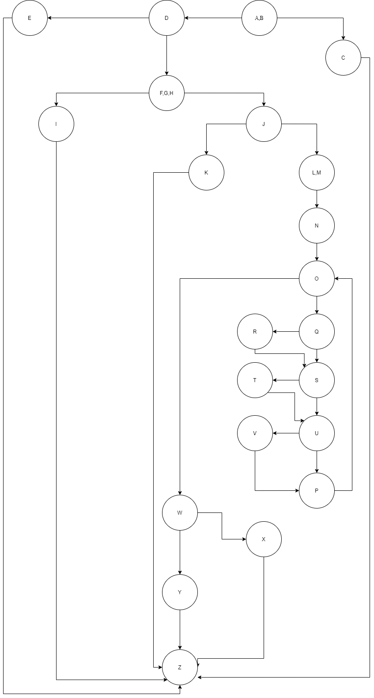

# Втора лабораториска вежба по Софтверско инженерство

## Горан Николов, бр. на индекс 173295

### Група на код: 

Ја добив групата на код 3

### Control Flow Graph

### Цикломатска комплексност

Цикломатската комплексност на овој код е 10, истата ја добив преку формулата P+1, каде што P е бројот на предикатни јазли. Во случајoв P=9, па цикломатската комплексност изнесува 10.
### Тест случаи според критериумот Every branch
1.A, B, - C

2.A, B,  - D

3.D- F, G, H

4.D - E

5.F, G, H - I

6.F, G,H - J

7.J - K

8.J -L,M

9.L,M - N

10.N - O

11.O - Q

12.O - W

13.Q - R

14.Q - S

15.R - S

16.S - T

17.S - U

18.T - U

19.U - V

20.U - P

21.V - P

22.P - O

23.W - X

24.W - Y

25.Y - Z

26.E -Z

27.C - Z

28.I - Z

29.K - Z

### Тест случаи според критериумот Every path

| Test case  | Path |
| :---------:| :----: |
| 1			|  A,B,C,Z |
| 2			|  A,B,D,E,Z |
| 3			|	 A,B,D,F,G,H,I,Z |
| 4			|  A,B,C,D,F,G,H,J,K,Z |
| 5			|  A,B,C,D,F,G,H,J,L,M,N,O,(Q,S,U,P,O)-19,W,X,Z |
| 6			|  A,B,C,D,F,G,H,J,L,M,N,O,(Q,S,U,P,O)-5,(Q,R,S,U,P,O)-1,(Q,S,U,P,O)-10,W,X,Z |
| 7			|  A,B,C,D,F,G,H,J,L,M,N,O,(Q,S,T,U,P,O)-1,(Q,S,U,P,O)-18,W,X,Z |
| 8			|  A,B,C,D,F,G,H,J,L,M,N,O,(Q,S,U,P,O)-18,(Q,S,U,V,P,O)-1,W,X,Z |
| 9			|  A,B,C,D,F,G,H,J,L,M,N,O,(Q,S,T,U,P,O)-1,(Q,S,U,P,O)-4,(Q,R,S,U,P,O)-1,(Q,S,U,P,O)-10,W,X,Z |
| 10		|  A,B,C,D,F,G,H,J,L,M,N,O,(Q,S,U,P,O)-5,(Q,R,S,U,P,O)-1,(Q,S,U,P,O)-9,(Q,S,U,V,P,O)-1,W,X,Z |
| 11		|  A,B,C,D,F,G,H,J,L,M,N,O,(Q,S,T,U,P,O)-1,(Q,S,U,P,O)-17,(Q,S,U,V,P,O)-1,W,X,Z |
| 12		|  A,B,C,D,F,G,H,J,L,M,N,O,(Q,S,T,U,P,O)-1,(Q,S,U,P,O)-4,(Q,R,S,U,P,O)-1,(Q,S,U,P,O)-9,(Q,S,U,V,P,O)-1,W,Y,Z |
